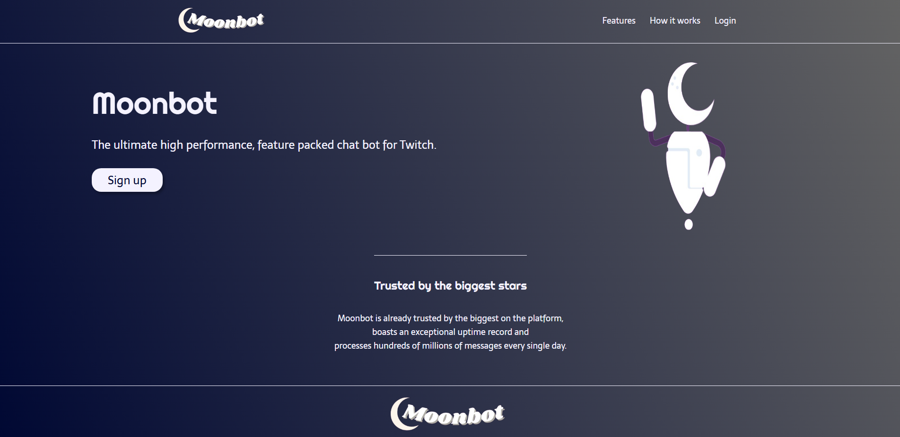

# Moonbot – Landing Page

This is a clean, responsive landing page for **Moonbot**, a fictional high-performance Twitch chatbot.  
It was built as a **personal project to practice HTML and CSS concepts** learned in college and showcase front-end development skills.

The Moonbot brand identity, including the **logo** and **robot icon** were designed by me using **Canva**.

---

## Features

- Fully responsive layout using Flexbox and media queries
- Clean, modern design with a dark gradient background
- Custom logo and mascot
- Interactive navigation and button with alert-based feedback
- Favicon included
- Google Fonts integration
- Scroll behavior and hover effects

---

## Preview
 
> 

---

## Tools

- HTML5
- CSS3
- [Google Fonts](https://fonts.google.com/)
- Canva (for custom graphic design)

---

## Conclusion

This project was created as part of my **web development learning journey**.  
It helped me apply layout, styling, and responsive design techniques using only HTML and CSS.

Thank you for checking out my project!

